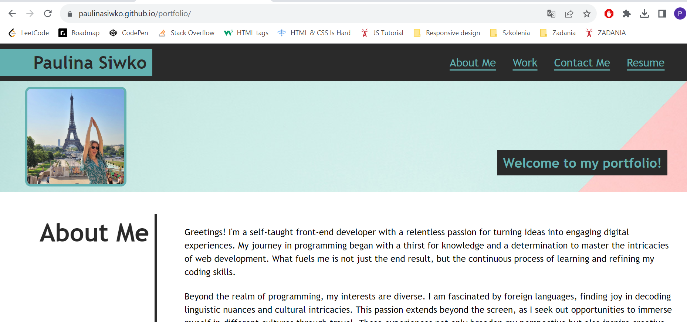

# portfolio

## Description
This project serves as my portfolio webpage, showcasing my various projects. The repository includes HTML and CSS files to create a visually appealing and responsive webpage. The primary purpose of this portfolio is to provide a centralized platform for displaying my projects and sharing my contact information. By maintaining this deployed webpage, I aim to present a comprehensive overview of my work and make it easy for others to connect with me.

## Installation
N/A

## Usage
This HTML file incorporates semantic HTML elements, adhering to a logical structure that remains independent of styling and positioning. Additionally, all image elements within the file include an accessible **alt** attribute, contributing to a more inclusive user experience.

The accompanying CSS file is equipped with **media queries** to enhance the webpage's responsiveness, ensuring optimal viewing across various devices.

The [URL] (https://paulinasiwko.github.io/portfolio/) of deployed application.

## Credits
N/A

## Licence 
N/A